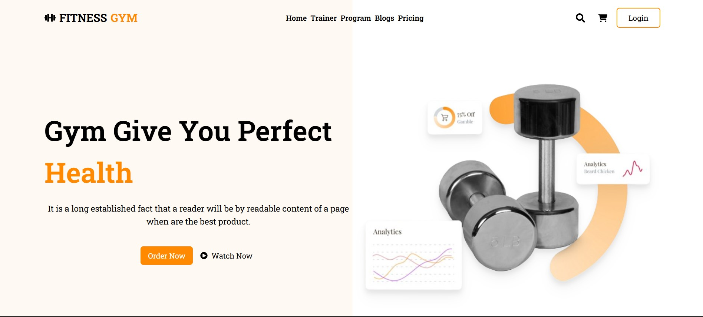
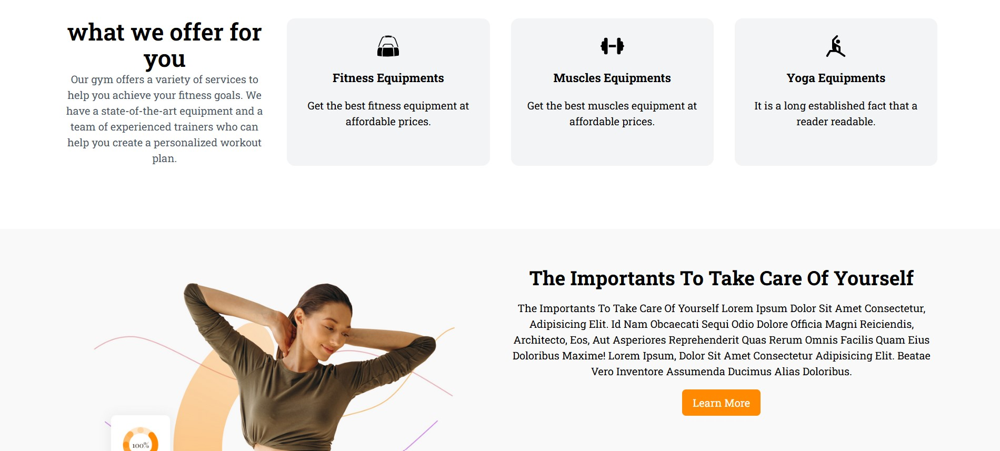

# Fitness Gym Website

A responsive fitness and gym website built with React and Tailwind CSS, featuring 
product listing, cart functionality, and smooth UI interactions.

## 🚀 Live Demo
[Live Demo](https://fitness-gym999.netlify.app/)

## screenshot

## 🧠 Overview
This project focuses on building a visually appealing and functional fitness website 
with real-world UI patterns and e-commerce-like features.

## ✨ Features
- Product listing and filtering
- Shopping cart and checkout flow
- Responsive design
- Smooth animations

## 🛠 Tech Stack
- React.js
- Tailwind CSS
- Framer Motion

## 📈 What I Learned
- Structuring UI-heavy React applications
- Enhancing UX with animations
